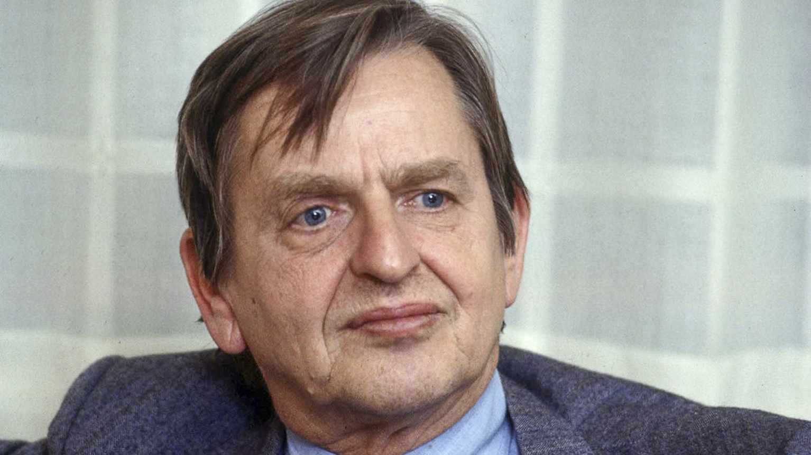
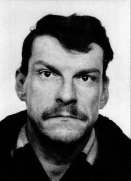
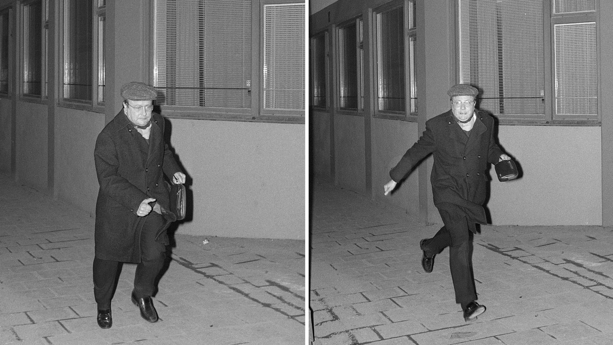
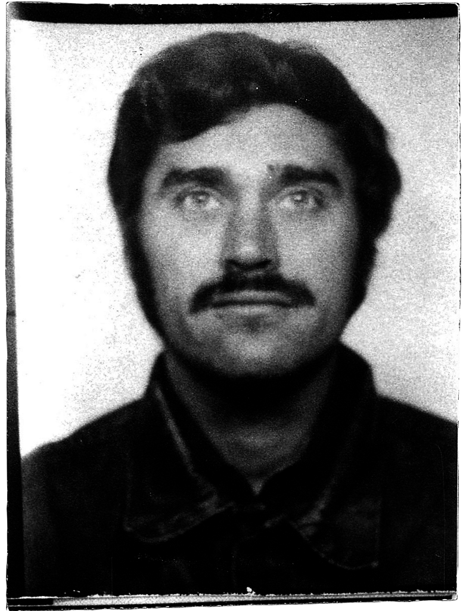

Olof Palme var en svensk statsminister. Fodd i Stockholm pa 30 januari 1927. Palme var en Livslång politiker, han borjade sins politiks karriar i 1953 som personnel sekreterare till statsminister Tage Erlander. Han klättrade uppför karriärstegen genom manga politik positioner, liksom kommunikationsminister i 1965 och utbildningsminister i 1968. I 1969 Palme valdes till partiordförande for Socialdemokraterna och statsminister kort därefter. Hon blev statsminister under den perion fran 1969 till 1976 som kallas "Palme Regering I", och fran 1982  till 1986 "Palme Regering II". 

Palme var en stark och ofta kontroversiell ledare, men också en mycket viktig person i svensk politik. Han var kand for sina starka tal, sitt engagemang for internationella frågor och sin kritik mot orättvisor. An idag minns manga honom som en symbol for socialdemokratin och for en dramatisk tid i Sveriges moderna historia.

# Mord

Olof Palme var mordrad Fredagen den 28 ferbruari 1986, efter han med sin familj hade besokt Grand bio pa Sveavägen 45. 

Palme var skjuten i ryggen och hans fru Lisbeth Palme var skadad men överlevde attacken. Detta hände vid korsningen mellan Sveavagen och Tunnelgatan Mordet chockade hela Sverige och blev en av de mest kända kriminalfallen i landets historia. Efter mordet startade en stor polisutredning, men under manga ar kunde man inte hitta en tydlig losning. Flera personer blev misstänkta och manga teorier spreds i medier och bland folket.

## Ett olöst mord

Mer än 40 år efter skotten på Sveavägen är mordet på Olof Palme fortfarande olöst. Över 10 000 personer har förhörts, 133 personer har erkänt mordet, och Palmeutredningen räknas som en av världens största och dyraste mordutredningar. Mordvapnet har aldrig hittats.

I juni 2020 lade chefsåklagare Krister Petersson ner utredningen och pekade samtidigt ut Stig Engström ("Skandiamannen") som den troliga gärningsmannen. Beslutet kritiserades hårt — bland annat av Justitieombudsmannen som 2021 ansåg att utpekandet stred mot oskuldspresumtionen. I december 2025 fastslog överåklagare Lennart Guné att bevisningen mot Engström inte räckte, och motiveringen till att lägga ner utredningen ändrades: Engström pekas inte längre ut som gärningsman. Det mest sannolika är att mordet aldrig kommer att få en lösning.

<iframe src="map.html" width="80%" height="700px" style="border:2px solid blue;"></iframe>

## Tidslinje för händelser under mordnatten

- 23:15 - Olof & Lisbeth Palme och deras son Mårten lämnade biografen Grand.
- 23:21 - Palme blir skjuten.
- 23:25 - Första ambulansen anländer till brottsplatsen.
- 23:31 - Ambulans tar bort Olof och Lisbeth till Sabbatsbergs sjukhus.
- 00:06 - Palme dödförklarad.
- 01:10 - Meddelade Riksradion (numera Sveriges Radio) att Palme hade mördats.
- 04:00 - Forsta TV nyhetssändning från Rapport pa SVT1.
- 05:15 - Regeringen håller presskonferens.

## Misstänkta

### Christer Pettersson (1947–2004)

En missbrukare och kriminellt belastad man som greps 1988. Lisbeth Palme pekade ut honom i en konfrontation och han dömdes för mordet 1989. Hovrätten friade honom dock på grund av bristande bevisning kring motiv och mordvapen. Pettersson dog 2004.

**Varför misstänkt:** Lisbeth Palme identifierade honom som skytten vid en vittneskonfrontation. Pettersson var känd för polisen sedan tidigare och hade kopplingar till kriminella miljöer i Stockholms innerstad. Han befann sig i området runt mordplatsen den aktuella kvällen.

**Varför osannolikt:** Inget mordvapen hittades och inget motiv kunde fastställas — Pettersson hade ingen känd koppling till Palme. Vittneskonfrontationen kritiserades hårt: Lisbeth Palme hade informerats i förväg om att den misstänkte var alkoholist, och Petterssons utseende gjorde honom lätt att peka ut. Hovrätten ansåg att bevisningen var otillräcklig.

### Stig Engström — "Skandiamannen" (1934–2000)

Grafisk designer som jobbade på Skandia, bara ett stenkast från mordplatsen. Han hävdade själv att han var det första vittnet på platsen. I juni 2020 pekade åklagare Krister Petersson ut Engström som gärningsmannen och lade ner utredningen eftersom Engström hade dött år 2000. I december 2025 meddelades dock att Engström inte längre betraktas som huvudmisstänkt.

**Varför misstänkt:** Engström jobbade nattskift på Skandia-kontoret vid Sveavägen och lämnade byggnaden ungefär vid tidpunkten för mordet. En nära bekant till honom, Willy Glaser, ägde vapen av samma typ som användes vid mordet. Engströms egna vittnesmål om händelseförloppet stämde dåligt överens med andra vittnens berättelser.

**Varför osannolikt:** Ingen teknisk bevisning kunde koppla Engström till mordet. Åklagaren erkände själv att bevisningen var för svag för att väcka åtal. Riksåklagaren fastslog i december 2025 att det var fel att peka ut Engström som mördare och att bevisningen inte räckte. JO konstaterade dessutom att åklagarens utpekande bröt mot oskuldspresumtionen.

### Victor Gunnarsson (1953–1993)

Högerextremistisk aktivist kopplad till EAP (Europeiska Arbetarpartiet), en LaRouche-rörelse som spred fientliga pamfletter mot Palme. Gunnarsson greps redan dagarna efter mordet men släpptes i april 1986 på grund av svag bevisning. Han emigrerade senare till USA där han själv mördades i North Carolina 1993.

**Varför misstänkt:** Gunnarsson var aktiv i EAP som öppet fördömde Palme och spred propaganda mot honom. Anti-Palme-flygblad hittades i hans bostad. Ett vittne placerade honom i närheten av mordplatsen den aktuella kvällen, och tips om honom började strömma in till polisen redan dagen efter mordet.

**Varför osannolikt:** Vittnesidentifieringen visade sig vara opålitlig och hans alibi kunde verifieras. Utredningen mot honom lades formellt ner i maj 1987. Gunnarsson mördades själv 1993 i North Carolina av en före detta polis i ett ärende som inte hade koppling till Palme-mordet.

## Källor

### Wikipedia
- [Olof Palme — Wikipedia (sv)](https://sv.wikipedia.org/wiki/Olof_Palme)
- [Mordet på Olof Palme — Wikipedia (sv)](https://sv.wikipedia.org/wiki/Mordet_p%C3%A5_Olof_Palme)
- [Assassination of Olof Palme — Wikipedia (en)](https://en.wikipedia.org/wiki/Assassination_of_Olof_Palme)
- [Christer Pettersson — Wikipedia (sv)](https://sv.wikipedia.org/wiki/Christer_Pettersson)
- [Stig Engström — Wikipedia (sv)](https://sv.wikipedia.org/wiki/Stig_Engstr%C3%B6m_(grafisk_formgivare))
- [Victor Gunnarsson — Wikipedia (en)](https://en.wikipedia.org/wiki/Victor_Gunnarsson)

### SVT Nyheter
- [Nya beslutet: Palmeutredningen återupptas inte (december 2025)](https://www.svt.se/nyheter/inrikes/motivering-till-nedlaggningsbeslut-om-palme-utredning-andras)
- [Detta har Palmegruppen gjort för att utreda Engström](https://www.svt.se/nyheter/inrikes/detta-har-palmegruppen-gjort-for-att-utreda-engstrom)
- [Tidslinje: Turerna kring Skandiamannen och Palmemordet](https://www.svt.se/nyheter/video/22034aa5daa1016b-tidslinje-har-ar-turerna-kring-skandiamannen-och-palmemordet)
- [Här hånar polisen Stig Engström](https://www.svt.se/nyheter/inrikes/har-hanar-polisen-stig-engstrom-hor-misstaget-som-kan-ha-sankt-palmeutredningen)

### Aftonbladet
- [Aftonbladet — Palmemordet (samlingssida)](https://www.aftonbladet.se/nyheter/palmemordet)

### Dagens Nyheter
- [DN — Palmemordet (samlingssida)](https://www.dn.se/om/palmemordet/)

### Övrigt
- [Yle — Många spår, många teorier i 30 år, men mordet är olöst](https://yle.fi/a/7-1042483)
- [CovertAction Magazine — Palme 40 Years](https://covertactionmagazine.com/)
